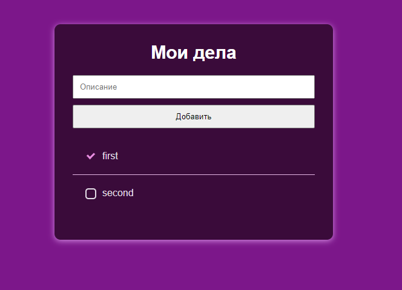
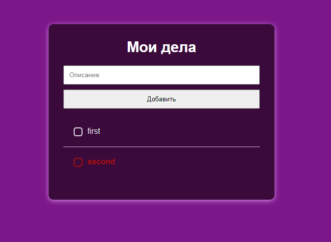
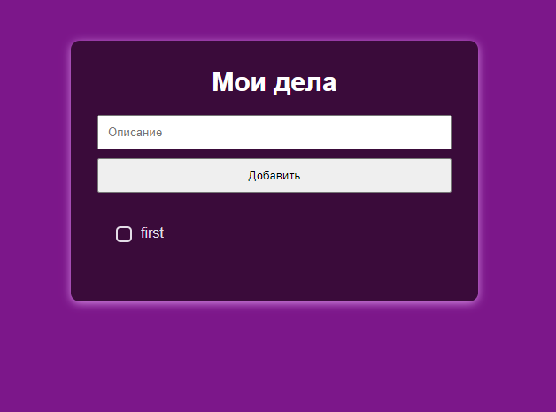
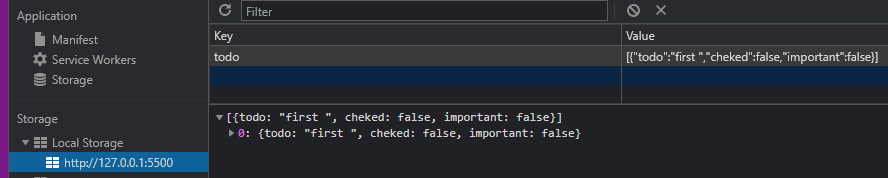

# Todo list
### A simple solution for recording your daily tasks.

Opportunities:

- *You can mark completed tasks.* 

- *By right-clicking on a task, you can mark it in red to highlight it as the main task.*

- *By pressing "ctrl + right mouse button / command + right mouse button" on the task,
you can delete it from the list.*

- *To save your tasks, the local library will be used.*

